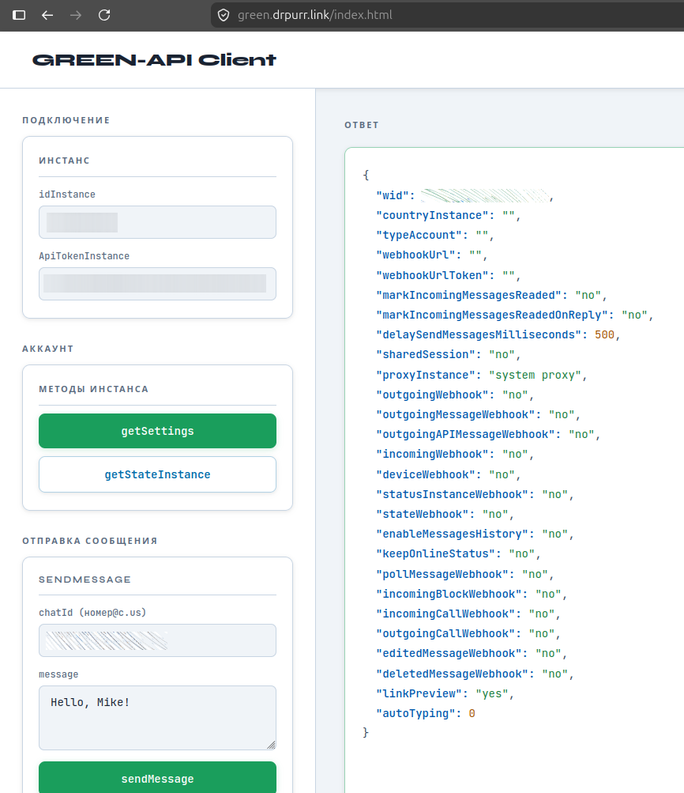
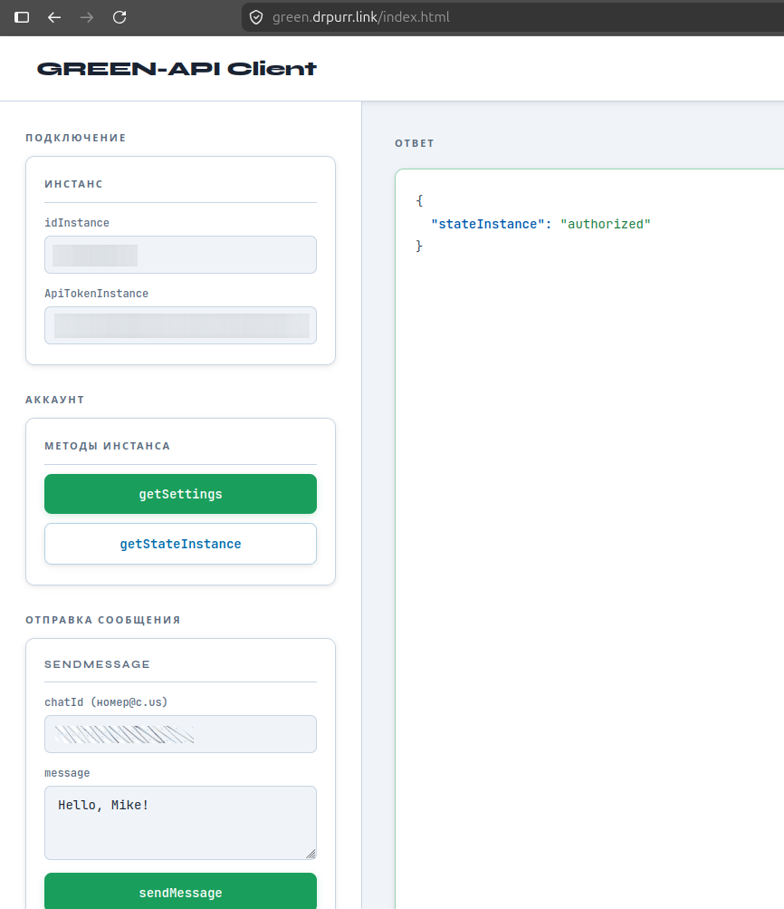
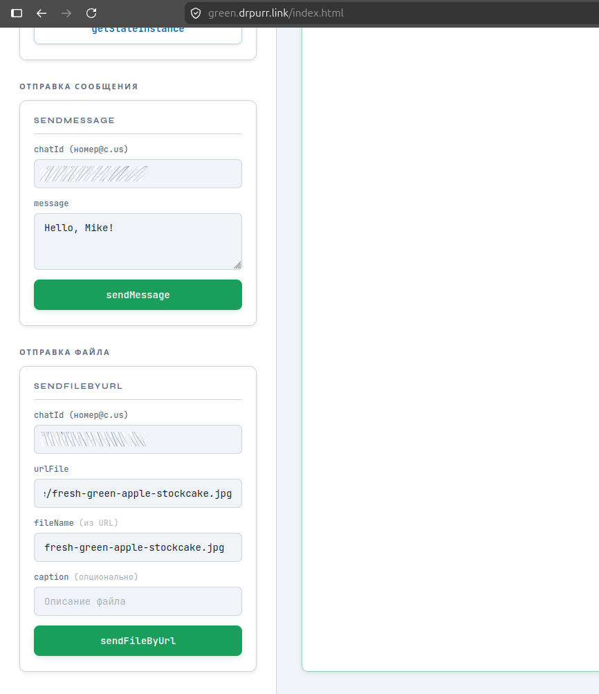
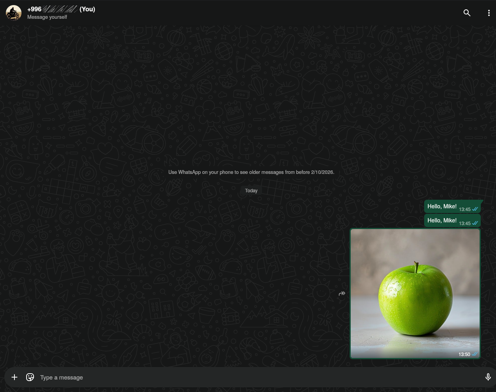

# GREEN-API Client

Веб-клиент для взаимодействия с [GREEN-API](https://green-api.com/) — провайдером WhatsApp API. Реализован как одностраничное HTML-приложение без внешних зависимостей (кроме шрифтов Google Fonts).

## Возможности

- **getSettings** — получение настроек инстанса
- **getStateInstance** — проверка состояния авторизации инстанса
- **sendMessage** — отправка текстового сообщения в указанный чат
- **sendFileByUrl** — отправка файла по URL с автоопределением имени файла и опциональной подписью

## Запуск

Откройте файл `index.html` в браузере. Сервер не требуется — всё работает на стороне клиента через `fetch` к `api.green-api.com`.

## Использование

1. Введите `idInstance` и `ApiTokenInstance` (получаются в [личном кабинете GREEN-API](https://console.green-api.com/))
2. Используйте кнопки в левой панели для вызова методов API
3. Ответ отображается в правой панели с подсветкой JSON-синтаксиса

## Скриншоты

| getSettings | getStateInstance |
|---|---|
|  |  |

| sendMessage + sendFileByUrl | Результат в WhatsApp |
|---|---|
|  |  |

## Стек

- HTML / CSS / JavaScript (vanilla)
- Шрифты: JetBrains Mono, Syne (Google Fonts)
- API: [GREEN-API REST API](https://green-api.com/docs/)
